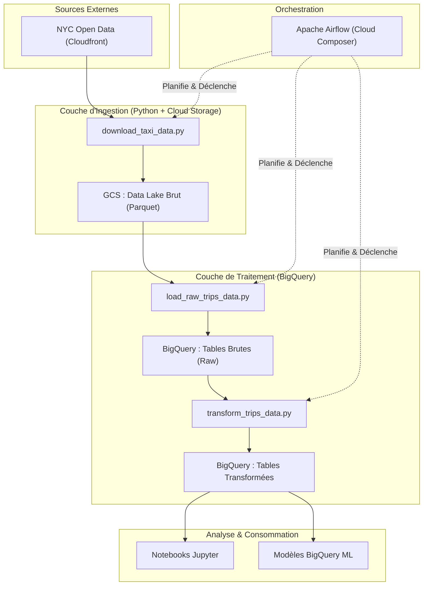

# Architecture Technique : Pipeline ETL NYC Taxi

Ce document propose une immersion technique dans la conception, le flux de données et les détails d'implémentation du pipeline ETL NYC Yellow Taxi.

## 📐 Conception du Système

L'architecture est construite autour du modèle **ELT (Extract-Load-Transform)**, séparant l'ingestion des données de leur traitement.



## 🔌 Composants du Pipeline

### 1. Extraction (`download_taxi_data.py`)
*   **Source :** Données d'enregistrement des trajets de la NYC Taxi & Limousine Commission (TLC).
*   **Format :** Parquet.
*   **Logique :** Parcourt les années (à partir de 2020) et les mois. Le script vérifie la présence des fichiers sur GCS avant le téléchargement pour garantir l'idempotence et éviter une utilisation redondante de la bande passante.
*   **Journalisation :** Les journaux (logs) sont diffusés et téléchargés vers `gs://{bucket}/from-git/logs/` à la fin de l'exécution.

### 2. Chargement (`load_raw_trips_data.py`)
*   **Processus :** Charge les données de GCS vers BigQuery.
*   **Staging :** Utilise une table temporaire (`_temp`) avec `autodetect=True` pour gérer l'ingestion initiale. Cela permet à BigQuery de gérer l'évolution potentielle du schéma avec souplesse.
*   **Ingestion Finale :** Exécute une requête `INSERT INTO` pour déplacer les données de la table temporaire vers la table brute principale, en convertissant explicitement `passenger_count` en `FLOAT64` pour maintenir la cohérence entre les différentes versions des fichiers sources.

### 3. Transformation (`transform_trips_data.py`)
*   **Implémentation :** SQL BigQuery pur.
*   **Logique de Nettoyage :**
    ```sql
    WHERE passenger_count > 0
      AND trip_distance > 0
      AND payment_type != 6 -- Filtrage des annulations/erreurs
      AND total_amount > 0
    ```
*   **Résultat :** Une table hautement optimisée prête pour l'analyse en aval.

### 4. Orchestration (`elt_dag_pipeline.py`)
*   **ID du DAG :** `elt_pipeline_nyc_taxi`
*   **Planification :** `0 23 * * 5` (Chaque vendredi à 23h).
*   **Capteur (Sensor) :** Inclut un `TimeDeltaSensor` pour contrôler précisément le moment de l'exécution (dernier vendredi du mois).
*   **Interopérabilité :** Utilise le `BashOperator` pour récupérer les scripts sur GCS et les exécuter dans l'environnement du worker Airflow.

## 🔒 Sécurité & Bonnes Pratiques

*   **Gestion des Identités :** Utilisation des comptes de service Google Cloud pour une authentification sécurisée et sans clé entre Airflow et GCS/BigQuery.
*   **Persistance des Journaux :** Tous les journaux des scripts sont conservés sur GCS pour l'audit historique et le dépannage.
*   **Optimisation des Coûts :** Exploite le format Parquet (colonnaire) et la logique `WRITE_TRUNCATE`/`WRITE_APPEND` de BigQuery pour minimiser les coûts de stockage et de calcul.
